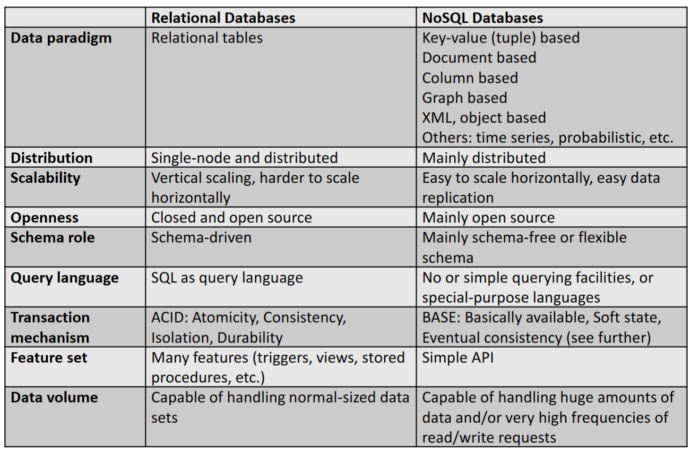

# NOSQL

## The 8 V’s of big data

- Volume: the amount of data, also referred to the data “at rest”
- Variety: the range of data types and sources that are used, data in its “many forms”
- Velocity: the speed at which data comes in and goes out, data “in motion”, streaming data
- Veracity: the uncertainty of the data, data “in doubt”
- Virality: How long do we need to keep data, when does it become outdated?
- Viscosity: Do we have enough data to perform (statistically) relevant analyses?
- Visualisation: can the results easily be presented?
- Value: what the value of our data? “Data is the new gold”.

VOORBEELD

Wie navigeert met apps als Google Maps of Waze krijgt real-time file -informatie ter beschikking.

Volume: Er komen enorme hoeveelheden data binnen van miljoenen gebruikers en sensoren wereldwijd.
Velocity: Data moet real-time verwerkt worden (files en verkeersdrukte live tonen).
Variety: Data komt uit verschillende bronnen: GPS-posities, snelheden, wegwerkzaamheden, ongelukken, weerdata.
Veracity: Niet alle data is 100% betrouwbaar (bv. foutieve GPS-metingen, valse meldingen door
gebruikers).
Value: De data wordt omgezet in waardevolle informatie voor de gebruiker: beste route, filewaarschuwing, tijdsbesparing.
Variability: Het datavolume en de verkeerssituatie wisselen sterk: spits vs. rustige uren, weekend vs werkweek.
Visualization: De data wordt weergegeven op een kaart met duidelijke kleuren (groen = vlot, rood = file).
Vulnerability: Er zijn privacy- en veiligheidszorgen: gebruikers delen locatiegegevens → bescherming volgens GDPR nodig.

## Vertical vs horizontal scaling

- Vertical scaling: extending storage capacity and/or CPU power of the database server (RDBMSs good at this)
- Horizontal scaling: multiple DBMS servers being arranged in a cluster (NOSQL good at this)

As you get large amounts, you need to scale things.

VERTICAL:

- You can scale things up using bigger boxes. It costs a lot and there are real limits as to how far you can go

HORIZONTAL

- You can use lots and lots of little boxes, just commodity hardware, all thrown into massive grids. Relational databases were not designed to run efficiently on clusters. It’s very hard to spread relational databases and run them on clusters

## Classical relational database ACID

- Atomic: A transaction is a logical unit of work which must be either completed with all of its data modifications or nothing at all
- Consistent: At the end of the transaction, all data must be left in a consistent state
- Isolated: Modifications of data performed by a transaction must be independent of another transaction. Otherwise the outcome of a transaction may be erroneous
- Durable: When the transaction is completed, effects of the modifications performed by the transaction must be permanent in the system
